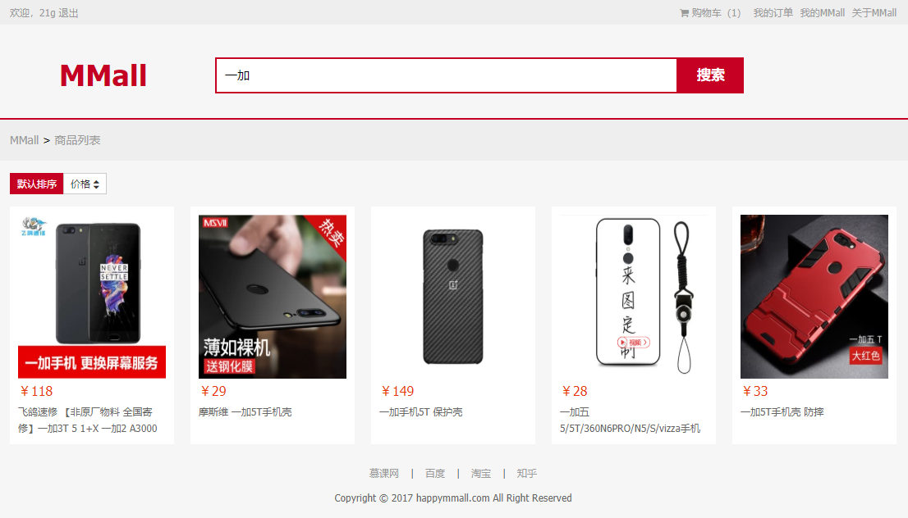
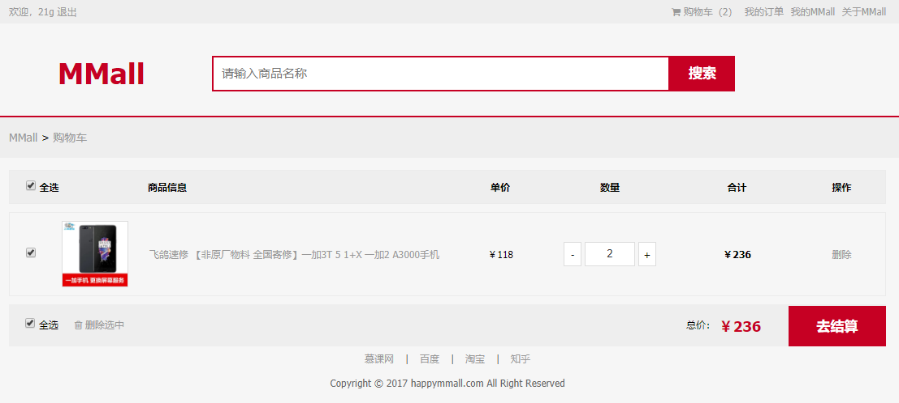
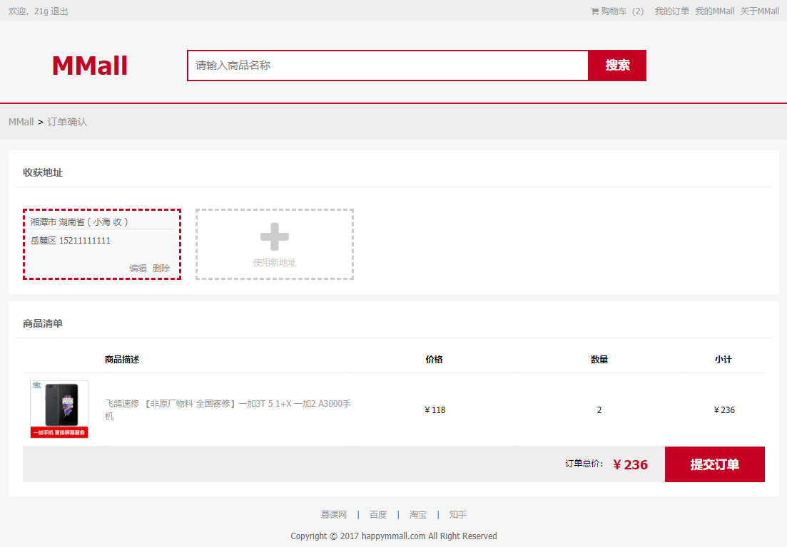
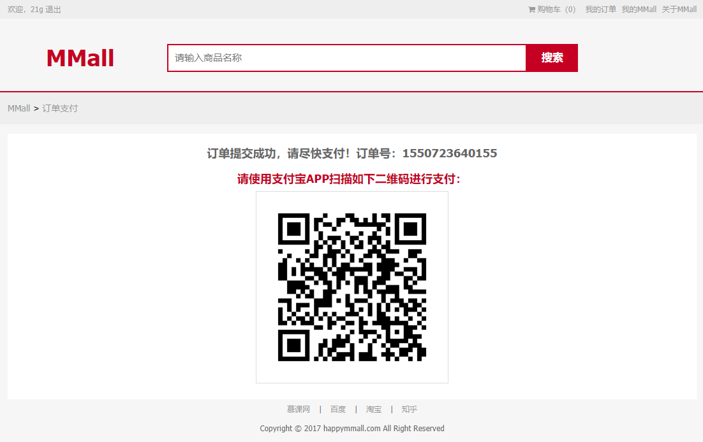
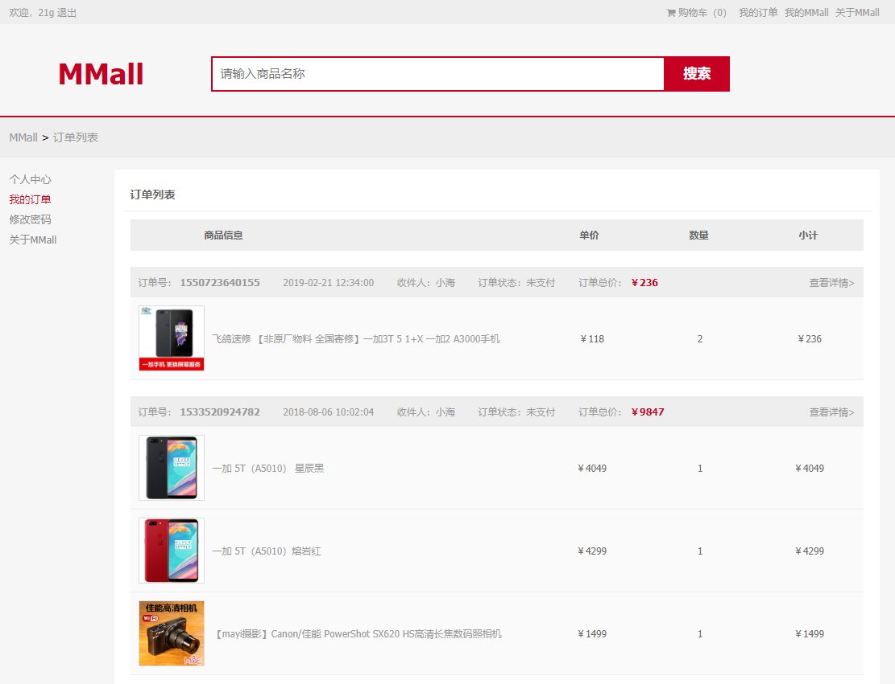
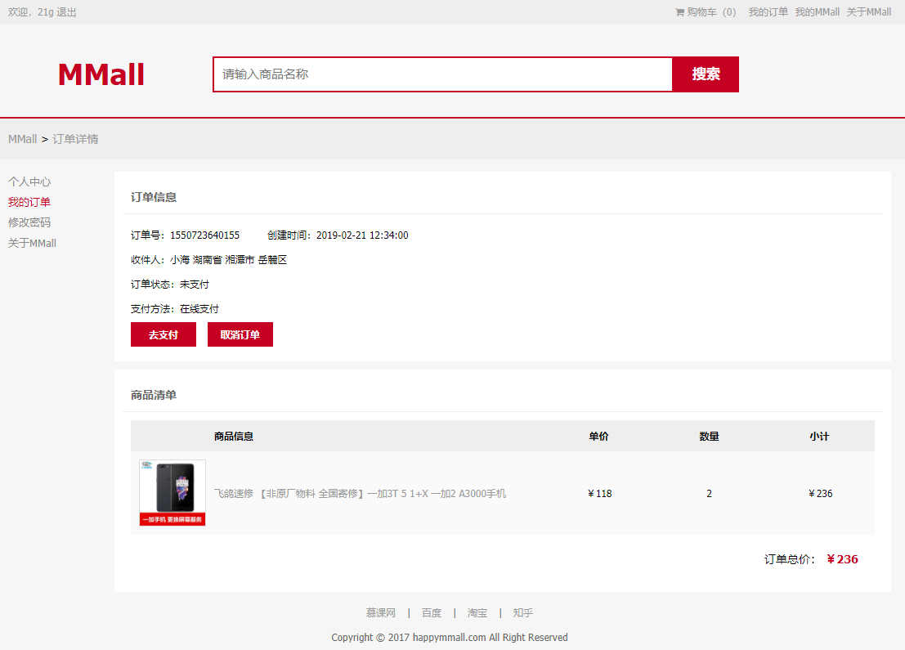

# MMALL商城

## 1. 项目描述

本项目为一个电商平台项目。主要包括用户登录注册、浏览商品、添加商品至购物车、支付、订单相关操作以及用户个人信息管理等。

本项目通过 webpack 构建多页应用。使用模块化进行开发，前后端分离。封装了一写通用模块，例如分页模块、请求模块等。同时，使用 Hogan模板引擎 渲染HTML页面。

## 2. 如何运行

### 2.1 项目运行

+ 克隆项目: `https://gitee.com/JavaScriptToLRH/mmall-fe.git`
+ 安装依赖: `npm install`
+ 启动项目: `npm run dev_win`
+ 在浏览器中访问：`http://localhost:8089/dist/view/index.html`

### 2.2 其它

+ 环境软件下载：<http://learning.happymmall.com>
+ HappyMMall数据接口: <https://gitee.com/imooccode/happymmallwiki>
+ 前台域名: <http://test.happymmall.com>
+ 后台域名: <http://admintest.happymmall.com>
+ 管理员登录的账号是: `admin`
+ 管理员登录的密码是: `admin`

``` text
来源：happymmall线上测试环境
作者：Geely
链接：https://www.imooc.com/article/19088
来源：慕课网
```

## 3. 项目备注

+ extract-text-webpack-plugin 最新版本为 3.0.2，这个版本还没有适应 webpack 4 的版本

  解决办法：使用 4.0 beta 版，npm install --save-dev extract-text-webpack-plugin@next

+ webpack多页应用配置，参考 [webpack.config.js](./webpack.config.js)
+ webpack升级4.x升级配置，参考 [小记webpack4.x升级过程](http://www.imooc.com/t/198337)
+ webpack1.15.0多页面配置，参考 [webpack.config.old.js](./webpack.config.old.js)

## 4. 项目展示














